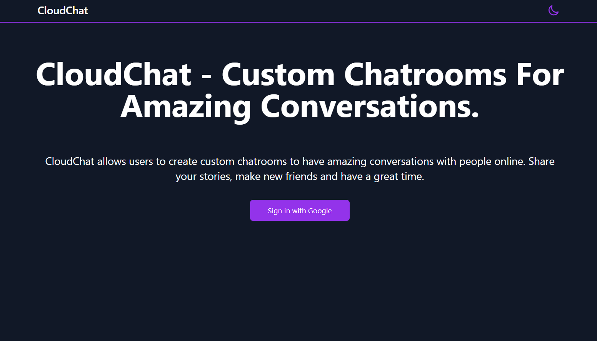
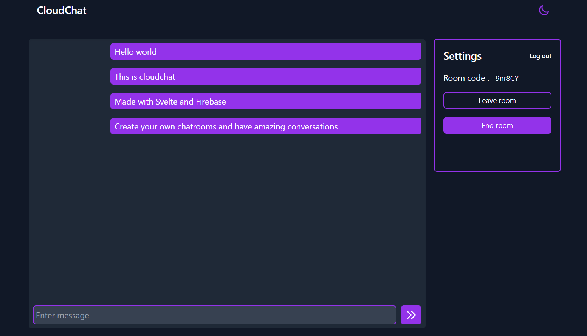

# CloudChat firebase app

Cloudchat is a social media app that allows users to create and manage custom chatrooms and have conversations with people online. 
Made using Svelte.js, TailwindCSS and Firebase.

## Features
- Create custom chat rooms
- Secure conversations
- Authenticate using only Google account
- Simple UI
- Light / Dark modes

## Tech stack
- Svelte.js (Frontend framework)
- Tailwind CSS (UI design)
- Firebase (Backend and database)

## Requirements
- Node.js
- Firebase web app

## Setup guide
- Create a new firebase web app in the firebase console.
- Copy your app's configuration object and place it in src/App.svelte file.
- Run the following command in the terminal to install the required dependencies : <b>npm install</b>
- Run the following command in the terminal to start the app : <b>npm run dev</b>
- Run the following command in another terminal to build the css : <b> npx tailwindcss -i ./public/tailwind.css -o ./public/global.css --watch</b>